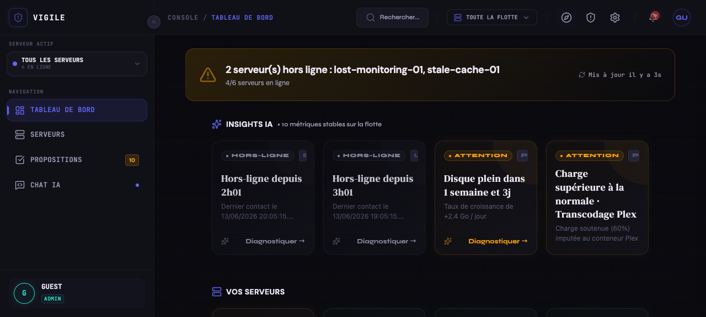
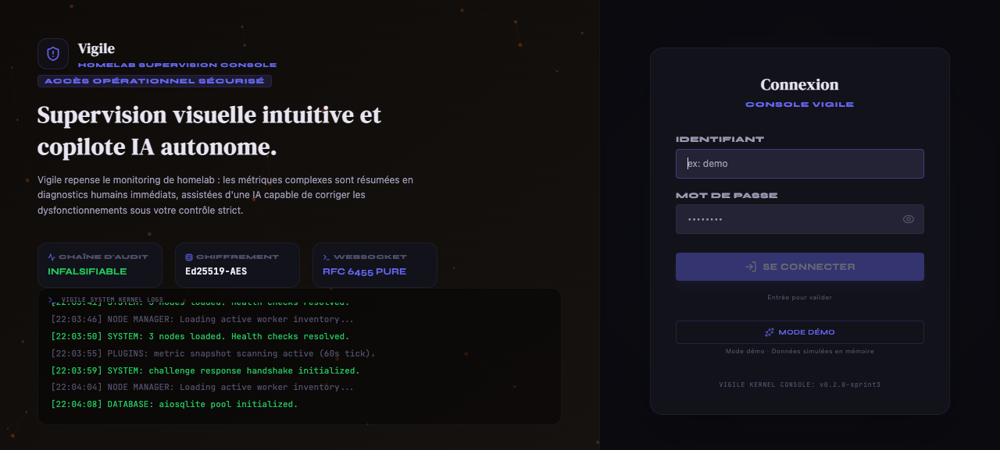
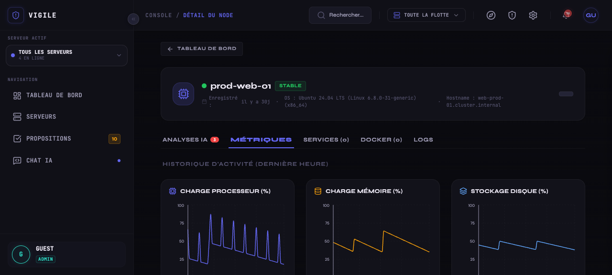
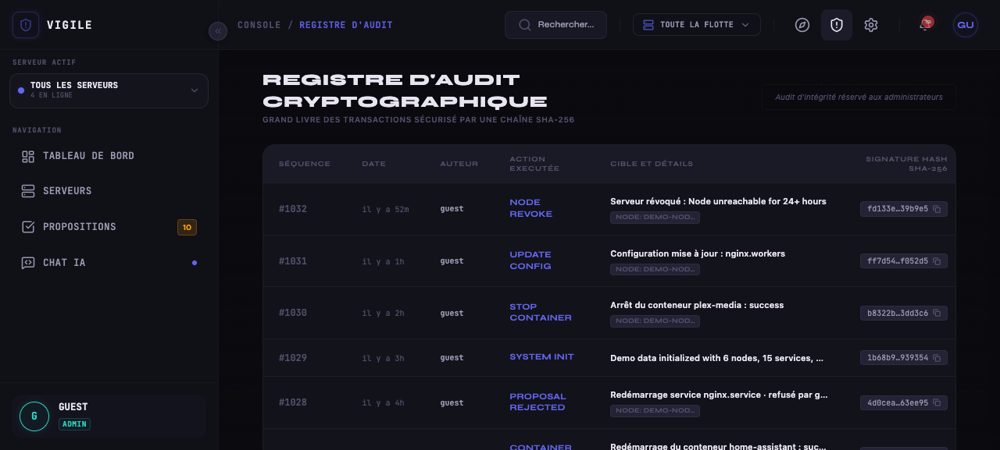

# 🕵️‍♂️ Vigile — L'agent qui veille sur votre serveur

L'IA est un excellent codeur, mais un administrateur système catastrophique sans garde-fou.



---

**Vigile, c'est quoi concrètement ?**

Un petit serveur (le **Master**) qui tourne sur un VPS ou un Raspberry Pi, auquel se connectent des **agents légers** (les **Workers**) installés sur chacun de vos serveurs. Le Master a un **cerveau IA** qui surveille tout, détecte les anomalies et propose des actions. Vous approuvez en un clic depuis une interface web, le Worker exécute. Zéro SSH, zéro script hasardeux, zéro risque de tout casser d'un coup.

**Ça remplace quoi ?** SSH + un monitoring type Netdata/Cockpit + un cerveau pour relier les deux.

**C'est pour qui ?**

- Pour ceux qui, comme moi, ont **la flemme** de se connecter en SSH à 2h du matin pour redémarrer un conteneur
- Pour ceux qui ont **un ou plusieurs serveurs** à gérer (homelab, VPS, serveur dédié) et n'ont pas envie d'y passer leur vie
- Pour ceux qui **ne sont pas admin sys** de formation mais qui font tourner des services chez eux
- Pour ceux qui veulent un **garde-fou** : l'IA peut proposer, mais jamais exécuter sans approbation humaine
- Pour ceux qui en ont **marre des alertes muettes** : Vigile ne se contente pas de dire "le disque est plein", il propose "supprimer les logs de la semaine dernière pour libérer 3 jours de stockage"

**En bref :** un pote IA qui veille sur vos serveurs pendant que vous dormez, et qui a assez de bon sens pour ne pas tout casser.

---

## L'histoire

J'ai un Homelab Debian pourri avec plein de conteneurs Docker (Plex, Home Assistant, Radarr...). Le serveur crash régulièrement. Entre les études et la flemme du soir, me connecter en SSH pour débugger un volume Docker devient une corvée. Donc je repousse. Et l'uptime s'effondre.

### Mais il y a pire

Ma box internet freeze. Mon serveur s'éteint sans raison. Je suis dehors, je n'y peux rien. J'ai une prise connectée pour forcer un reboot, mais quand le serveur est mort, comment savoir si c'est un crash OS, un problème réseau ou une panne de courant ?

Pire : si mon monitoring tourne sur ce même serveur qui vient de mourir, j'ai perdu mes yeux.

### La belle idée qui a mal tourné

Alors j'ai pensé : pourquoi ne pas utiliser une IA (Claude Code, etc.) pour diagnostiquer et réparer tout ça ? Génial. L'IA lisait les logs, ponctionnait le code, réparait mes conteneurs en quelques secondes.

Jusqu'au jour où j'ai demandé un simple tri de fichiers.

Une mauvaise interprétation. Une commande mal écrite. 3 secondes. Et boum : l'IA a déplacé, écrasé, concaténé **toute la connerie de mon serveur dans un seul fichier texte**. Zéro backup. Zéro garde-fou.

**Détruit par une hallucination.**

C'est là que j'ai compris deux trucs :

1. Donner un shell root à une IA c'est la folie
2. Monitorer depuis le serveur qu'on surveille, c'est une erreur architecturale

---

## Architecture & Concept

Pour pallier ces faiblesses, **Vigile** sépare le cerveau décisionnel du bras exécutant avec un modèle strict sans shell interactif :

```text
+-------------------------------------------------------+
|                    MASTER (VPS)                       |
|  - API FastAPI                                        |
|  - SQLite (aiosqlite) - Users, Nodes, Audit Trail     |
|  - Agent LLM & Actions de Chat                        |
|  - Frontend React SPA                                 |
+--------------------------^----------------------------+
                           |
                     (WebSocket)
             (Handshake Challenge Ed25519)
                           |
+--------------------------v----------------------------+
|                    WORKER (Debian)                    |
|  - Executable Go (Zéro dépendance, stdlib only)        |
|  - Exécute des actions whitelistées uniquement        |
|  - Pas de shell root (exec.Command direct sans /bin/sh)|
+-------------------------------------------------------+
```

### Avantages de cette conception :
1. **Pas de shell interactif** : Le Worker n'offre aucun terminal arbitraire à l'IA. Il utilise un ensemble d'actions structurées whitelistées (gestion de services systemd, contrôle de conteneurs Docker, lecture de journaux systemd ou fichiers log).
2. **Reverse WebSocket** : C'est le Worker qui se connecte au Master. Pas besoin d'exposer vos machines locales au web.
3. **Audit Trail immuable** : Les mutations et actions exécutées sont enregistrées sous forme de chaîne de hash cryptographique SHA-256 (append-only) pour garantir la traçabilité.

---

## Aperçu de l'Interface

Voici un aperçu de la console d'administration Vigile avec des données de simulation (mode Démo) :

### 🔐 Écran de Connexion
L'écran de connexion sécurisé permet de s'authentifier de manière robuste ou d'accéder au mode Démo pour tester les fonctionnalités en mémoire.



### 📈 Supervision détaillée des Nœuds
Chaque nœud de la flotte expose des métriques détaillées d'activité (CPU, RAM, Disque) ainsi que l'état en direct de ses services systemd et conteneurs Docker.



### 🛡️ Registre d'Audit Cryptographique
L'ensemble des actions et mutations ordonnées par l'opérateur ou proposées par le copilote IA sont scellées dans une chaîne append-only de hashs SHA-256 pour garantir une traçabilité totale et infalsifiable.



---

## La Stack

*   **Master** : FastAPI (Python 3.12+).
*   **Base de Données Master** : SQLite avec `aiosqlite`. Finie l'époque où un cache Redis temporaire perdait l'état.
*   **Worker** : Go (1.23+), pur stdlib. Sans aucune bibliothèque tierce.
*   **Protocole Réseau** : RFC 6455 WebSocket. Enrôlement sécurisé via échange de clé Ed25519 (handshake challenge-response) et validation HMAC.

---

## Guide de Démarrage Rapide

### 1. Lancer le Master (VPS / Local)

Installez les dépendances et lancez l'application :

```bash
# Installer les dépendances
pip install -r requirements.txt

# Lancer le serveur Master en local
$env:PYTHONPATH="."  # Windows PowerShell
# ou export PYTHONPATH="." # Linux/macOS
python -m uvicorn master.main:app --host 127.0.0.1 --port 8000 --reload
```

Le Master va initialiser la base de données SQLite `./data/vigile.db` et créer le compte administrateur par défaut : `admin` / `admin` (sans changement de mot de passe obligatoire, sauf si la variable d'environnement TESTING est définie à true).

> **Mode démo** : pour explorer Vigile sans aucune configuration, utilisez les identifiants `guest` / `guest` depuis l'écran de connexion. Toutes les données (nœuds, métriques, propositions, audit) sont simulées en mémoire et réinitialisées au redémarrage du serveur.

### Stack Docker

Pour déployer la stack Master + Worker en local via Docker :

```bash
# Lancer le serveur Master
docker compose up -d master

# Vérifier que le Master répond
curl -sk http://localhost:8000/health

# Enrôler des Workers
./scripts/setup_test.sh --workers 2
```

Le Worker se connecte directement en `ws://` au Master sur le port 8000.

### 2. Enrôler un Worker

1. Connectez-vous à l'interface d'administration ou utilisez l'API pour générer un jeton d'enrôlement :
   ```bash
   POST /api/nodes/generate-join
   ```
2. Lancez le Worker Go en lui transmettant le jeton généré :
   ```bash
   cd worker
   go run . --master wss://localhost:443 --token <JOIN_TOKEN> --key-dir ./data
   ```
3. Une fois l'enrôlement Ed25519 complété, la paire de clés privée/publique du Worker est enregistrée et toute communication ultérieure passera par le WebSocket authentifié cryptographiquement.

---

## API Endpoints Clés

### Authentification et Sécurité
*   `POST /api/auth/login` : Authentification et génération de jetons d'accès JWT / Refresh Tokens avec rotation de famille et détection de vol.
*   `POST /api/auth/change-password` : Force le changement du mot de passe initial.
*   `POST /api/auth/refresh` : Rafraîchissement des jetons d'accès.
*   `POST /api/auth/logout` : Révocation de la session.

### Gestion de Flotte
*   `GET /api/nodes` : Liste paginée des serveurs supervisés.
*   `POST /api/nodes/generate-join` : Génération d'un jeton HMAC-SHA256 à usage unique pour enrôler un nouveau nœud.
*   `DELETE /api/nodes/{node_id}` : Révocation permanente d'un nœud.

### Audit
*   `GET /api/audit` : Journal d'audit paginé et sécurisé.
*   `GET /api/admin/audit-verify` : Vérifie l'intégrité de la chaîne de hash de l'audit.

### Alerts et Monitoring
*   `GET /api/alerts` : Liste paginée des alertes déclenchées.
*   `GET /api/alerts/summary` : Résumé agrégé des alertes par sévérité et nœud.
*   `POST /api/alerts/{alert_id}/acknowledge` : Acquitte une alerte active.

### Plugins
*   `GET /api/plugins` : Liste des plugins installés.
*   `GET /api/plugins/{plugin_id}` : Détail et configuration d'un plugin.
*   `POST /api/plugins/{plugin_id}/config` : Mise à jour de la configuration d'un plugin.
*   `POST /api/plugins/{plugin_id}/toggle` : Activer/désactiver un plugin.
*   `POST /api/plugins/upload` : Téléverser un nouveau plugin.
*   `GET /api/plugins/pages` : Pages de l'interface fournies par les plugins.
*   `POST /api/plugins/registry/{plugin_id}/install` : Installer un plugin depuis le registre.

### Settings
*   `GET /api/settings` : Récupérer la configuration LLM et globale.
*   `POST /api/settings/llm` : Mettre à jour les paramètres LLM (modèle, température, API key).
*   `POST /api/settings/llm/test` : Tester la connectivité LLM avec un ping simple.

### Worker Binary
*   `GET /api/{os}/{arch}/worker` : Télécharger le binaire Worker compilé pour l'OS et l'architecture cible.
*   `GET /api/{os}/{arch}/worker.sha256` : Télécharger le hash SHA-256 du binaire Worker.
*   `GET /api/binary/refresh` : Reconstruire le cache des binaires Worker.
*   `GET /api/manifest.json` : Manifest des versions de Worker disponibles.
*   `GET /api/public-key` : Clé publique Ed25519 du Master pour vérification des signatures.

### Streaming
*   `GET /api/stream` : Flux SSE des événements nœuds en temps réel (connexions, déconnexions, métriques).

### Nœuds (étendu)
*   `GET /api/nodes/connections` : Liste des connexions WebSocket actives.

### Administration
*   `GET /api/admin-only` : Vérification des permissions administrateur.
*   `POST /api/reset` : Réinitialiser la base de données de démonstration.

---

## Contribuer

Ce projet existe parce qu'une hallucination IA m'a détruit mon serveur. Nous voulons éviter que cela n'arrive à d'autres. Les contributions pour étendre la liste des actions sûres du Worker ou intégrer d'autres services sont les bienvenues !

---

**Gardons nos serveurs en ligne, et nos fichiers en un seul morceau.**

*Vigile — Écrit par un étudiant qui a perdu son serveur à cause d'une IA. Zéro culpabilité.*
